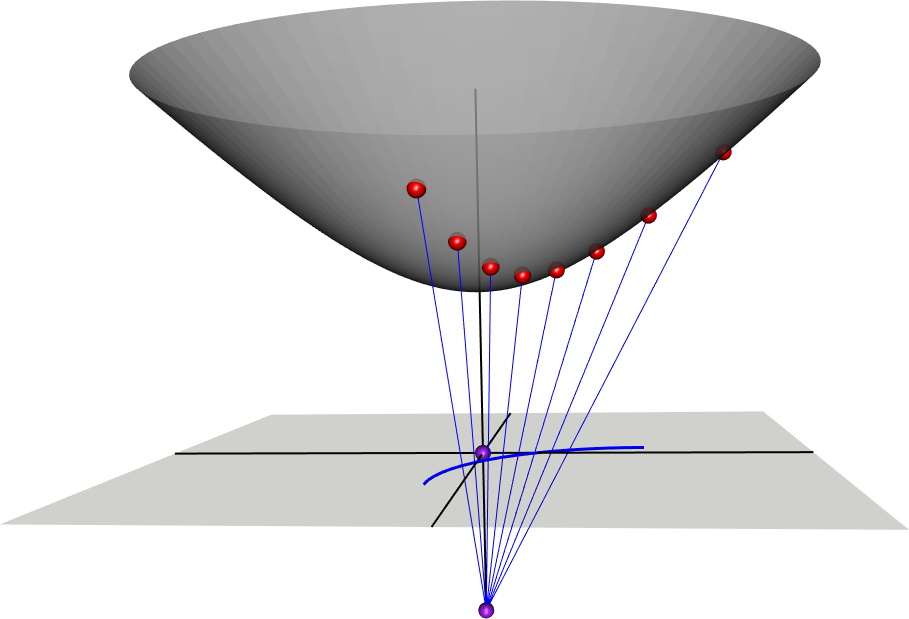
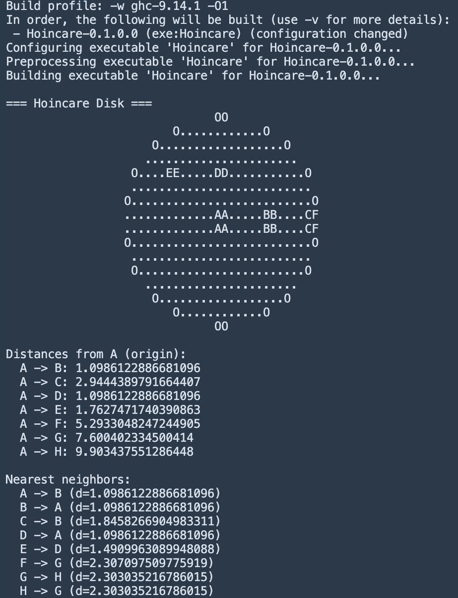

# Hoincare

The H is silent.
A Poincaré disk implementation in Haskell. Built for fun, math, and the visceral experience of watching distances cascade toward infinity.

## What is the Poincaré Disk?

*Stereographic projection from the hyperboloid model onto the Poincaré disk. CC BY-SA 4.0* - [License](https://commons.wikimedia.org/wiki/File:HyperProjectionUsingRgl.png)

The Poincaré disk is a model of hyperbolic geometry where an entire infinite plane is represented inside a unit disk. Points live at coordinates (x, y) where x² + y² < 1 — inside but never touching the boundary.
The boundary is not a wall. It is infinity.

## The Distance Function

Distance between two points u and v on the disk is given by:
`d(u, v) = arccosh( 1 + 2||u - v||² / ((1 - ||u||²)(1 - ||v||²)) )`
As a point approaches the boundary, the denominator `(1 - ||u||²)` approaches zero, causing distance to diverge. A point at 0.9 is already 2.94 units from the origin. A point at 0.9999 is 9.90 units away — nearly double — despite looking nearly identical on screen.

## Boundary Experiment

Pushing a point along the x-axis toward 1.0:

| Point | Coordinate | Distance from Origin |
|-------|------------|----------------------|
| C     | 0.9        | 2.94                 |
| F     | 0.99       | 5.29                 |
| G     | 0.999      | 7.60                 |
| H     | 0.9999     | 9.90                 |

Each additional 9 costs roughly 2.3 hyperbolic units. The boundary is unreachable. F, G, and H are nearest neighbors to each other — an exile colony, geometrically isolated from the rest of the disk despite appearing adjacent in Euclidean space.

### Boundary Experiment Results

## Features

- Poincaré disk distance function
- Smart point constructor enforcing `|z| < 1`
- ASCII disk visualization
- Nearest neighbor queries

## Why Haskell?

It seemed funny at the time. The math translated cleanly. No regrets.

## References 
[Wikipedia Poincare Disk Model](https://en.wikipedia.org/wiki/Poincar%C3%A9_disk_model)